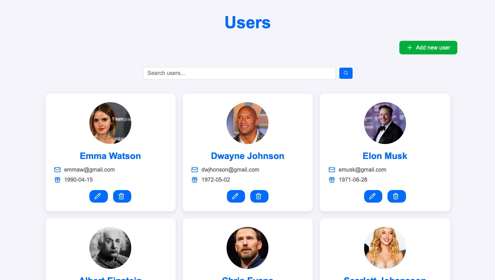

cat << 'EOF' > README.md
# 🌟 Estéfani Torres - Creative Web Developer Portfolio
  
  [](https://your-portfolio-url.com)
  
  
  
</div>

## 🎨 Portfolio Highlights

| Project | Description | Technologies |
|---------|-------------|--------------|
| [Users Manager](https://users-managerr.netlify.app/) | CRUD application for user management | React, CSS3, API Integration |
| [Weather App](https://weatherrraapp.netlify.app) | Real-time weather information | JavaScript, API Integration |
| [Fortune Cookie](https://galletadefortuna.netlify.app/) | Random fortune generator | JavaScript, CSS Animations |
| [Rick & Morty App](https://rickmortyyy-app.netlify.app/) | Character exploration portal | API Integration, JavaScript |

## 🛠 Technical Skills

<div align="center">


</div>

## ✨ Soft Skills

```text
✅ Organized       ✅ Creative
✅ Team Player     ✅ Punctual
✅ Proactive       ✅ Self-taught
✅ Responsible     ✅ Detail-oriented
```

## 🌟 Featured Projects

### 🧑‍💻 Users Manager


A complete CRUD application built with:
- User creation, reading, updating, and deletion
- Intuitive interface design
- Data validation

[](https://users-managerr.netlify.app/)
[](https://github.com/estefaniii/Crud-app)

## 🚀 Getting Started

To run this portfolio locally:

```bash
# Clone the repository
git clone https://github.com/estefaniii/portfolio.git
cd portfolio

# Open in browser (no build required for static site)
open index.html
```

## 📬 Contact Me

<div align="center">

[](https://wa.me/50767782931)
[](mailto:estefanidelosangelestorres@gmail.com)
[](https://www.linkedin.com/in/yourprofile)

</div>

## 📜 License

This project is open source and available under the [MIT License](LICENSE).

---

<div align="center">
  <p>📍 Based in Panamá Oeste, Panamá</p>
</div>
EOF
